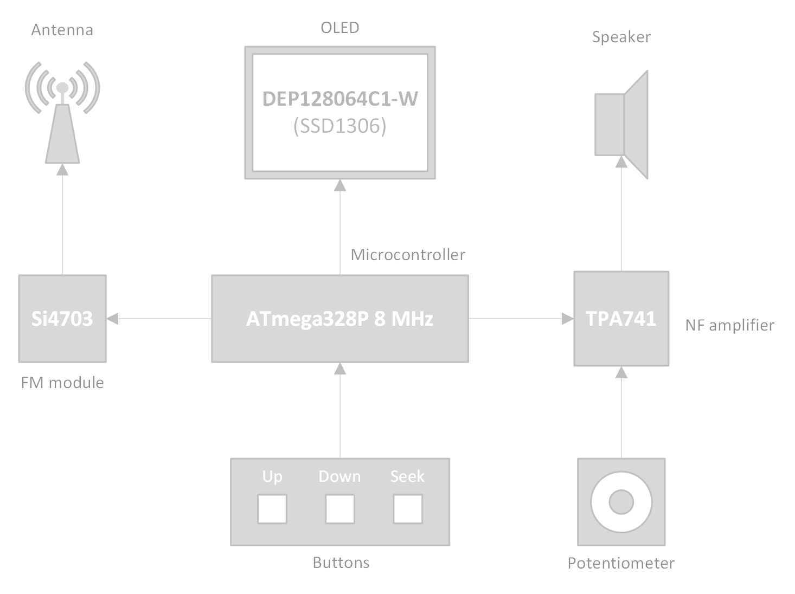
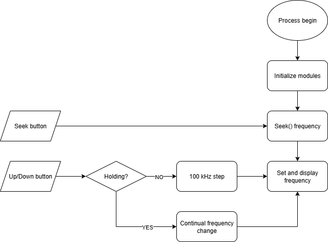

# FM Radio

## Our team:

Adam Keřka  
Martin Čontoš  
Karel Kubín 

## Introduction
This project focuses on the implementation of an FM receiver system using the Si4703 FM module controlled by an ATmega328P microcontroller. A simple display is included to present basic information, and a low-voltage audio amplifier drives a small speaker, allowing us to both see and hear the signals received by the FM module. The goal of this project is to create a compact prototype radio system that can be further developed into even more sophisticated designs in the future.

 

  

## Hardware

| Component              | Model            | Description |
|------------------------|------------------|-------------|
| FM Module              | Si4703           | Low-power FM radio receiver (50–115 MHz) |
| Display                | DEP128064C1-W    | 128×64 monochrome OLED display, SSD1306 driver. |
| Microcontroller        | ATmega328P       | 8-bit AVR microcontroller commonly used in Arduino UNO but 8 MHz. |
| Audio Power Amplifier  | TPA741           | Low-voltage LF audio amplifier capable of driving small speakers. |
| Speaker                | CDS-25148-L100   | power = 1.5 W, resistance = 8 omhs, intensity = 94 dBA |
| Programmer             | CP2102           | Universal programmer with USB-UART converter | 
| 4pcs buttons           | ---              | Serves for controlling frequency and seek-up function  | 
| Led                    | ---              | Indicates power state ON/OFF  |           

## Software 

Upon powering the device, the ATmega328P initializes the FM module and display and immediately sets an initial frequency. This is achieved by calling the seek function, which scans the FM band and locks onto the strongest station available. Simultaneously initial frequency is displayed on the OLED. The radio then begins to play without unnecessary delay. 

After the first radio frequency being set, radio is waiting for an user input. Up/Down buttons request frequency changes by switching voltage on determined ATmega328P inputs. FM module is then updated accordingly and it results in tuning the desired radio station. Tuning radio is also possible by pressing the seek button triggering the seek-up function.

Volume is controlled by potentiometer connected in the feedback loop of TPA741 amplifier. In future we would like to utilize the internal DACs of Si4703 for adjusting the volume. Si4703 enables digital adjustment on 15 levels involving mute.

 

  

### Init 
Init function initializes the Si4703. Main goal of initialization is to establish TWI communication between the FM module and microcontroller and to set the module to standby mode (Power-up sequence). This function also sets default settings which are not intended to change during the program run: Mute Disable: ON, Mono: ON, RDS Enable: ON, De-emphasis: ON (50us), Band Select: 00 (87,5 - 105 MHz), Channel Spacing: 01 (100 kHz), Volume: 1111 (max), RSSI Seek Treshold: 0x19 (25 from <0;127>), Seek SNR Threshold: 0x04 (4 from <0;7>), Seek FM Impulse Detection Threshold: 0x08 (8 from <0;15>).

### Mono
Si4703 has 2 pins dedicated for an audio output (L + R) too enable both Mono and Stereo audio modes. Since stereo mode requires system of 2 speakers we force Si4703 to output only mono (both pins then output the same signal).

### Seek
Searches (seeks) radio station according to the strength of RSSI (Received Signal Strenght Indicator). In other words if Seek function finds a station which fulfils a lower limit of the RSSI, the station is tuned. Seek function is devided into SI4703_SeekUp() and SI4703_SeekDown() function. We can adjust seeking by setting appropriate register.

Bits 8 to 10 (SEEK, SEEKUP, SKMODE) are reserved for Seek function in Power configuration register. SEEK enables seeking by setting this bit to 1. SEEKUP determies direction of seeking within band 87.5 to 108 MHz. If we set SEEKUP bit to 1, it starts to "seek up" from actual frequency. Otherwise it starts to seek down. If SKMODE is set to 1, seek function stops seeking at the upper or lower band limit. In this project we prefer SKMODE to be set to 0, so the function continues seeking even after reaching the band limit.

In SEEKTH[7:0] you can set RSSI seek treshold.

### Volume 
Despite using potentiometer as part of UI (User Interface) for controlling volume, it is neccessary to set an initial volume of Si4703.

Volume can be controlled by VOLUME[3:0] bits in System configuration 2 register. Bit combination of "0000" stands for mute, which is also the default value, and combination of "1111" for maximum volume.  Volume scale is logarithmic.

VOLEXT is 8th bit of the System congiguration 3 register and attenuates the output by 30dB if set to 1. Default value is 0, so in this program.

## References

Library U8g2 for SSD1306 display driver by [OLIKRAUS](https://github.com/olikraus/u8g2/tree/master/csrc)
Used together with [gpio.c](https://raw.githubusercontent.com/tomas-fryza/avr-labs/master/library/gpio/gpio.c) and [gpio.h](https://raw.githubusercontent.com/tomas-fryza/avr-labs/master/library/gpio/gpio.h)

Library AVR_Si4703 for Si4703 FM module by [eziya](https://github.com/eziya/AVR_SI4703)

Datasheet Si4703 [SKYWORKS](https://www.skyworksinc.com/-/media/SkyWorks/SL/documents/public/data-sheets/Si4702-03-C19.pdf)

## Poster in progress...

